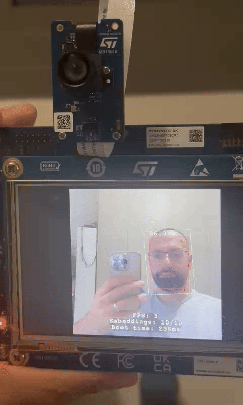

# STM32N6 Face Recognition System

A comprehensive embedded face recognition system implementing real-time face detection and recognition on STM32N6570-DK development board using STEdgeAI.

## Features

- **Real-time Face Detection** using CenterFace neural network model
- **Face Recognition** with MobileFaceNet embeddings and cosine similarity
- **Multi-face Tracking** with embedding bank and similarity voting
- **Hardware Acceleration** via STM32N6 NPU (Neural Processing Unit)
- **Live Camera Input** with ISP processing pipeline
- **PC Streaming Interface** for remote monitoring and control
- **LCD Display Output** with face detection visualization
- **Optimized Performance** for embedded deployment



## 🚀 Quick Start

### Prerequisites

1. **STM32CubeIDE** - Primary development environment
2. **STM32EdgeAI** - Model conversion tool (stedgeai)
3. **STM32CubeProgrammer** - Firmware flashing tool
4. **ARM GCC Toolchain** - Cross-compilation toolchain

### Setup

1. **Configure tool paths**
   Edit `stm32_tools_config.json` and set the correct paths for your installation

2. **Build Process**
   ```bash
   # Convert AI models
   ./scripts/compile_model.sh face_detection ./input_models/centerface.tflite
   ./scripts/compile_model.sh face_recognition ./input_models/mobilefacenet_int8_faces.onnx
   
   # Build in STM32CubeIDE, then sign and flash
   ./scripts/sign_binary.sh ./embedded/STM32CubeIDE/Debug/Project.bin
   ./scripts/flash_firmware.sh all
   ```

## Hardware Requirements

- **STM32N6570-DK** development board
- **Camera Module** (IMX335, VD55G1, or VD66GY supported)
- **LCD Display** (800x480 resolution)
- **USB Connection** for programming and debugging
- **PC** with STM32CubeIDE or ARM GCC toolchain

## 📁 Project Structure

```
STM32N6-FaceRecognition/
├── stm32_tools_config.json          # Tool configuration
├── scripts/                         # Build and deployment scripts
│   ├── compile_model.sh             # AI model conversion
│   ├── sign_binary.sh               # Binary signing
│   └── flash_firmware.sh            # Firmware flashing
├── input_models/                    # Input model files (.onnx, .tflite)
├── converted_models/                # Generated model code and binaries
└── embedded/                        # STM32 embedded project
    ├── STM32CubeIDE/                # IDE project files
    ├── Src/                         # Application source code
    ├── Inc/                         # Header files
    ├── Models/                      # Generated model C files
    ├── Binary/                      # Final binaries for flashing
    ├── Makefile                     # Alternative build system
    ├── Middlewares/                 # STM32 middleware
    └── STM32Cube_FW_N6/            # STM32 firmware library
```

## Development Workflow

### Prerequisites

1. **STM32CubeIDE** (recommended) or ARM GCC toolchain
2. **STM32CubeProgrammer** for flashing
3. **STM32EdgeAI** for model conversion

### Build and Flash

1. **Configure and convert models:**
   ```bash
   # Configure tool paths in stm32_tools_config.json
   # Convert AI models
   ./scripts/compile_model.sh face_detection ./input_models/centerface.tflite
   ./scripts/compile_model.sh face_recognition ./input_models/mobilefacenet_int8_faces.onnx
   ```

2. **Build the embedded project:**
   ```bash
   # Using Makefile (from embedded directory)
   cd embedded && make clean && make -j$(nproc)
   
   # Or using STM32CubeIDE  
   # Open embedded/STM32CubeIDE project, clean and rebuild
   ```

3. **Flash the complete system:**
   
   The STM32N6 requires flashing **four separate components** in this order:
   
   ```bash
   # 1. Flash FSBL (First Stage Boot Loader) at 0x70000000
   STM32_Programmer_CLI -c port=SWD mode=HOTPLUG -el MX66UW1G45G_STM32N6570-DK.stldr -w Binary/ai_fsbl.hex
   
   # 2. Flash Face Detection Model at 0x71000000
   STM32_Programmer_CLI -c port=SWD mode=HOTPLUG -el MX66UW1G45G_STM32N6570-DK.stldr -w Binary/det_network_data.hex
   
   # 3. Flash Face Recognition Model at 0x72000000
   STM32_Programmer_CLI -c port=SWD mode=HOTPLUG -el MX66UW1G45G_STM32N6570-DK.stldr -w Binary/rec_network_data.hex
   
   # 4. Flash signed application at 0x70100000
   STM32_Programmer_CLI -c port=SWD mode=HOTPLUG -el MX66UW1G45G_STM32N6570-DK.stldr -w Binary/STM32N6_GettingStarted_ObjectDetection_signed.hex
   ```
   
   **Important Notes:**
   - Set BOOT1 switch to **right position** (dev mode) before flashing
   - All .hex files are pre-built and available in the `Binary/` directory
   - The external loader `MX66UW1G45G_STM32N6570-DK.stldr` is required for external flash programming
   - After flashing, set BOOT1 switch to **left position** (boot from flash) and power cycle

4. **Connect and run:**
   - Connect camera module and LCD
   - Power on the board
   - System will start face detection automatically

## System Architecture

```
Camera → ISP → Face Detection (NPU) → Face Cropping → Face Recognition (NPU) → Display/Stream
         ↓              ↓                   ↓              ↓                    ↓
    Image Buffer   Detection Results   Cropped Faces   Embeddings          UI Output
```

### Key Components

- **Face Detection**: CenterFace model (128x128 input, INT8 quantized)
- **Face Recognition**: MobileFaceNet model (112x112 input, INT8 quantized)
- **Image Processing**: Hardware-accelerated cropping, resizing, format conversion
- **Embedding Management**: Multi-face tracking with similarity-based voting
- **Communication**: UART protocol for PC interface

## AI Models

### Face Detection Model
- **Architecture**: CenterFace
- **Input**: 128x128 RGB
- **Output**: Face bounding boxes + keypoints
- **Quantization**: INT8
- **Performance**: ~9ms inference time

### Face Recognition Model
- **Architecture**: MobileFaceNet
- **Input**: 112x112 RGB aligned faces
- **Output**: 128-dimensional embeddings
- **Quantization**: INT8
- **Performance**: ~120ms inference time

## Configuration

### Key Configuration Options (`Inc/app_config.h`)

```c
// Input source selection
#define INPUT_SRC_MODE INPUT_SRC_CAMERA  // or INPUT_SRC_PC

// Display settings
#define LCD_FG_WIDTH  800
#define LCD_FG_HEIGHT 480

// AI model parameters
#define AI_PD_MODEL_PP_CONF_THRESHOLD (0.5f)  // Detection confidence
#define AI_PD_MODEL_PP_MAX_BOXES_LIMIT (10)   // Max detected faces

// Camera settings
#define CAMERA_FLIP CMW_MIRRORFLIP_NONE
#define CAPTURE_FORMAT DCMIPP_PIXEL_PACKER_FORMAT_RGB565_1
```

## Project Structure

```
├── Src/                    # Application source code
├── Inc/                    # Header files
├── Models/                 # AI model files (C code)
├── Exercises/              # Implementation examples and tutorials
├── STM32Cube_FW_N6/       # STM32 HAL drivers and BSP
├── Middlewares/            # AI runtime and camera middleware
├── python_tools/           # PC-side Python utilities
├── Binary/                 # Pre-built firmware binaries
└── Doc/                    # Additional documentation
```

## PC Interface

The system supports PC connectivity for enhanced functionality:

### Python Tools
```bash
cd python_tools
pip install -r requirements.txt
python run_ui.py  # Launch GUI interface
```

### Features
- **Live Video Stream** from embedded system
- **Face Recognition Results** display
- **Configuration Management**
- **Firmware Update** capabilities

## Performance

### Typical Performance Metrics
- **Face Detection**: 8-10 FPS (including preprocessing)
- **Face Recognition**: 15-20 FPS per face
- **Memory Usage**: ~800KB RAM, ~25MB External Flash (including AI models)
- **Power Consumption**: ~0.25 W for the MCU only during full operation

### Optimization Features
- **NPU Acceleration** for neural network inference
- **Multi-threading** with hardware acceleration
- **Memory Pool Management** for efficient allocation
- **Cache-optimized** image processing algorithms

## Development

### Building from Source

1. **Install Dependencies:**
   - ARM GCC toolchain (arm-none-eabi-gcc)
   - STM32CubeProgrammer
   - Make utility
   - clang-format and clang-tidy (for code quality)

2. **Configure Build:**
   ```bash
   # Standard build
   make clean && make
   
   # Debug build with symbols
   make clean && make DEBUG=1
   ```

3. **Code Quality Checks:**
   ```bash
   # Format code according to standards
   make format
   
   # Check code formatting
   make format-check
   
   # Run static analysis
   make analyze
   
   # Run all quality checks
   make check
   ```

4. **Custom Model Integration:**
   - Replace models in `Models/` directory
   - Update model configurations in `Inc/app_config.h`
   - Rebuild and test

### Adding New Features

The codebase is designed for extensibility:

- **Image Processing**: Extend `Src/crop_img.c`
- **AI Models**: Add models to `Models/` directory
- **Communication**: Modify `Src/enhanced_pc_stream.c`
- **Display**: Update `Src/display_utils.c`

## Testing

### Hardware-in-Loop Testing
```bash
# Flash test firmware
make flash

# Run Python test suite
cd python_tools
python -m pytest tests/
```

### Performance Profiling
- Built-in timing measurements
- ITM trace support for detailed profiling
- Memory usage analysis tools

## Documentation

Additional documentation available:

- [Application Overview](Doc/Application-Overview.md)
- [Boot Process](Doc/Boot-Overview.md)
- [Build Options](Doc/Build-Options.md)
- [Model Deployment](Doc/Deploy-your-tflite-Model.md)
- [Programming Guide](Doc/Program-Hex-Files-STM32CubeProgrammer.md) - Complete flashing procedure
- [Build Setup](BUILD_SETUP.md) - Post-clone build instructions
- [Coding Standards](CODING_STANDARDS.md) - Embedded C best practices

## Contributing

We welcome contributions! Please see [CONTRIBUTING.md](CONTRIBUTING.md) for guidelines.

### Development Workflow
1. Fork the repository
2. Create feature branch
3. Install git hooks for code quality: `./install-git-hooks.sh`
4. Implement changes following coding standards
5. Run quality checks: `make check`
6. Write tests for new functionality
7. Submit pull request

## License

This project contains multiple license terms:
- Application code: [See LICENSE](LICENSE)
- STM32 components: ST proprietary license
- Third-party libraries: Various (see individual components)

## Support

- **Issues**: [GitHub Issues](../../issues)
- **Documentation**: [Project Wiki](../../wiki)
- **Community**: [Discussions](../../discussions)

## Acknowledgments

- STMicroelectronics for STM32N6 platform and STEdgeAI
- Original model authors (CenterFace, MobileFaceNet)
- Open source community contributors

---

**Built for the embedded AI community**
